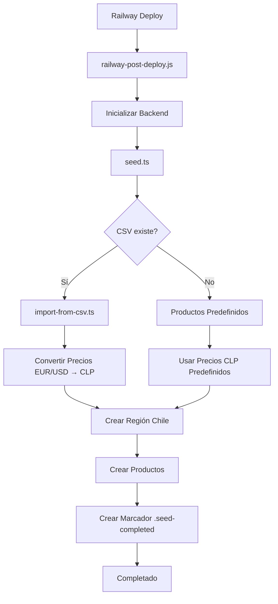

# 🇨🇱 Guía Completa - Seed de Productos para Chile

## 📋 Resumen

He creado un sistema completo de seed para productos de mascotas (perros) específicamente para Chile, basándome en la imagen de categorías que proporcionaste. El sistema incluye:

- ✅ **Archivo seed principal** (`seed.ts`) con 45+ productos organizados en 7 categorías
- ✅ **Importación desde CSV** (`import-from-csv.ts`) para usar tu archivo existente
- ✅ **Configuración automática** para Railway
- ✅ **SKUs generados automáticamente** desde nombres de productos
- ✅ **Precios en CLP** con valores realistas del mercado chileno
- ✅ **Protección contra duplicados** y control de ejecución

## 🎯 Productos Incluidos (Basados en tu Imagen)

### 📦 Categorías y Productos

**1. Comida (8 productos)**
- Comida Seca Premium/Adultos/Cachorros
- Comida Húmeda en Lata/Sobres  
- Comida Medicada
- Dietas Especiales (Renal/Digestiva)

**2. Snacks y Premios (8 productos)**
- Huesos Naturales y Bully Sticks
- Snacks de Carne Natural
- Congelados en Seco
- Snacks Blandos, Galletas
- Snacks de Larga Duración
- Snacks para Higiene Dental

**3. Juguetes (5 productos)**
- Juguetes para Morder y Tirar
- Peluches Suaves
- Juguetes para Recuperar
- Dispensadores de Premios
- Juguetes Rompecabezas

**4. Accesorios (10 productos)**
- Camas Ortopédicas/Regulares
- Platos y Bowls Antideslizantes
- Correas Retráctiles/Fijas
- Collares y Arneses
- Accesorios de Adiestramiento
- Jaulas y Transportadores

**5. Higiene y Baño (4 productos)**
- Toallitas Húmedas
- Pads Absorbentes
- Bolsas Biodegradables
- Pañales Desechables

**6. Peluquería (5 productos)**
- Cepillos de Cerdas
- Shampoos Hipoalergénicos
- Acondicionadores
- Corta Uñas Profesional
- Productos Skin Care

**7. Farmacia (6 productos)**
- Tratamiento Antipulgas y Garrapatas
- Vitaminas Multivitamínicas
- Suplementos Articulares
- Productos para Alergias
- Termómetro Digital
- Medicamentos Veterinarios

## 🔧 Archivos Creados/Modificados

### Nuevos Archivos
- `backend/src/scripts/seed.ts` - Archivo principal de seed
- `backend/src/scripts/import-from-csv.ts` - Importador desde CSV
- `backend/CHILE-SEED-README.md` - Documentación detallada
- `backend/CHILE-SEED-COMPLETE-GUIDE.md` - Esta guía

### Archivos Modificados
- `backend/package.json` - Agregados scripts de seed
- `backend/src/scripts/seed.ts` - Integrado con importación CSV

### Archivos Existentes (Ya Funcionan)
- `backend/railway-post-deploy.js` - Script de post-deploy
- `backend/railway.json` - Configuración de Railway
- `backend/start-with-seed.sh` - Script de inicio

## 🚀 Cómo Usar el Sistema

### Opción 1: Usar tu Archivo CSV (Recomendado)

1. **Coloca tu archivo CSV** en la raíz del proyecto:
   ```bash
   # Copia tu archivo CSV a la raíz del backend
   cp "c:\Users\Ezkol\Downloads\product-import-template.csv" backend/product-import-template.csv
   ```

2. **El seed detectará automáticamente** el CSV y lo importará durante el deploy en Railway

3. **Los productos se crearán** con precios convertidos a CLP desde EUR/USD

### Opción 2: Usar Productos Predefinidos

Si no tienes CSV, el sistema usará los 45+ productos predefinidos basados en tu imagen.

### Deploy en Railway

El sistema está configurado para ejecutarse automáticamente en Railway:

1. **Haz push** a tu repositorio
2. **Railway detectará** el proyecto
3. **Se ejecutará automáticamente**:
   - `railway-post-deploy.js`
   - `seed.ts` (con CSV si existe, sino productos predefinidos)
   - Creación de región Chile (CLP)

## 💰 Precios en CLP

### Conversión Automática (CSV)
- **EUR → CLP**: 1 EUR = 1000 CLP (aproximado)
- **USD → CLP**: 1 USD = 900 CLP (aproximado)

### Precios Predefinidos
- **Comida Premium**: $25,000 - $45,000 CLP
- **Snacks**: $3,200 - $12,000 CLP
- **Juguetes**: $8,900 - $18,500 CLP
- **Accesorios**: $7,500 - $45,000 CLP
- **Higiene**: $3,200 - $12,500 CLP
- **Peluquería**: $6,800 - $15,000 CLP
- **Farmacia**: $15,000 - $35,000 CLP

## 🔍 SKUs Generados

Los SKUs se generan automáticamente desde el nombre del producto:

**Ejemplos:**
- "Comida Seca Premium para Perros" → `COMIDASECAPRE`
- "Huesos Naturales de Res" → `HUESOSNATRES`
- "Shampoos Hipoalergénicos" → `SHAMPOOSHIPO`

## 📊 Scripts Disponibles

```bash
# Ejecutar seed completo (detecta CSV automáticamente)
npm run seed:chile

# Importar solo desde CSV
npm run import-csv

# Crear productos de perros (método anterior)
npm run create-dog-products

# Forzar seed (ignora duplicados)
FORCE_SEED=true npm run seed:chile

# Verificar estado del seed
npm run seed:verify

# Resetear marcador de seed
npm run seed:reset
```

## 🎛️ Configuración Avanzada

### Variables de Entorno

```bash
# Forzar ejecución del seed (ignora duplicados)
FORCE_SEED=true

# Especificar ruta del CSV
CSV_FILE_PATH=/path/to/your/file.csv
```

### Personalización de Precios

Para ajustar la conversión de precios, edita en `import-from-csv.ts`:

```typescript
// Cambiar estos valores según el tipo de cambio actual
const convertEURtoCLP = (eurPrice: number): number => {
  return Math.round(eurPrice * 1000) // Ajustar multiplicador
}

const convertUSDtoCLP = (usdPrice: number): number => {
  return Math.round(usdPrice * 900) // Ajustar multiplicador
}
```

## 🔄 Flujo de Ejecución



## ✅ Verificación Post-Deploy

### Logs a Buscar en Railway

```
🇨🇱 Iniciando seed de productos para Chile...
📥 Archivo CSV encontrado, importando productos desde CSV...
🌍 Configurando región de Chile...
✅ Región de Chile creada exitosamente
📦 Importando 111 productos desde CSV...
✅ Producto importado: Alimento Seco Premium Perro Adulto (SKU: PRR-CS-001) - $25.990 CLP
...
🎉 Importación desde CSV completada:
   ✅ Productos creados: 111
   ❌ Errores: 0
   🇨🇱 Región: Chile (CLP)
```

### Verificar en Admin Dashboard

1. Ve a tu Admin Dashboard de Medusa
2. Navega a **Productos**
3. Deberías ver todos los productos importados
4. Verifica que los precios estén en **CLP**
5. Verifica que los SKUs sean correctos

## ⚠️ Consideraciones Importantes

### 1. **Archivo CSV**
- Debe estar en formato de importación de Medusa.js
- Debe tener las columnas correctas (Product Title, Variant SKU, etc.)
- Los precios deben estar en EUR o USD

### 2. **Duplicados**
- El sistema previene duplicados automáticamente
- Usa `FORCE_SEED=true` solo si necesitas re-ejecutar
- **Elimina la variable** después de usarla

### 3. **Base de Datos**
- Asegúrate de que la BD esté vacía para el primer deploy
- El sistema crea la región de Chile automáticamente

### 4. **Precios**
- Los precios son aproximados (ajusta según tu mercado)
- La conversión EUR/USD → CLP es estimada
- Revisa y ajusta precios después del deploy

## 🆘 Troubleshooting

### Problema: CSV no se importa
**Solución**: Verifica que el archivo esté en `backend/product-import-template.csv`

### Problema: Precios incorrectos
**Solución**: Ajusta los multiplicadores en `import-from-csv.ts`

### Problema: Productos duplicados
**Solución**: Limpia la BD o usa `FORCE_SEED=true` (y elimínalo después)

### Problema: Región no se crea
**Solución**: Verifica que no haya conflictos con regiones existentes

## 📞 Soporte

Si tienes problemas:

1. **Revisa los logs** completos en Railway Dashboard
2. **Verifica** que todas las variables de entorno estén configuradas
3. **Asegúrate** de que la base de datos esté accesible
4. **Contacta** al equipo con logs específicos

---

## 🎉 ¡Listo para Deploy!

Tu sistema está configurado y listo para crear productos de mascotas para Chile en Railway. Solo necesitas:

1. **Colocar tu CSV** en `backend/product-import-template.csv` (opcional)
2. **Hacer push** a tu repositorio
3. **Railway se encargará** del resto automáticamente

¡Los productos se crearán con SKUs derivados de los nombres y precios en CLP! 🇨🇱🐕
