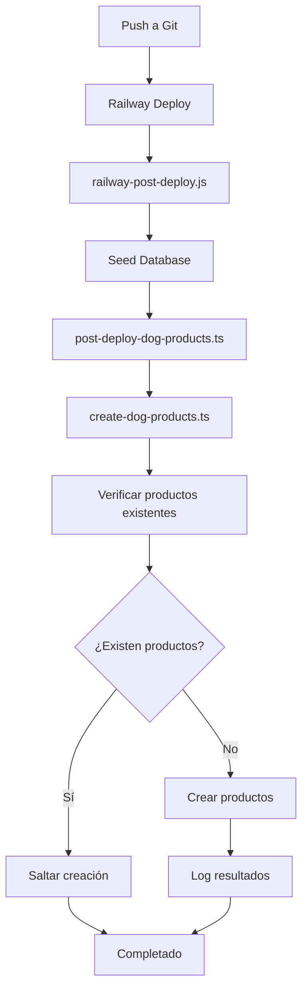

# 🐕 Sistema de Productos para Perros - MedusaJS

Este sistema automatiza la creación de productos para perros en el panel de administración de MedusaJS basándose en categorías específicas.

## 📋 Características

- **Creación Automática**: Los productos se crean automáticamente después del deploy en Railway
- **Categorías Completas**: Incluye todas las categorías de productos para perros:
  - Comida (Seca, Húmeda, Medicada, Dietas Especiales)
  - Snacks y Premios (Huesos, Bully Sticks, Carne Natural, etc.)
  - Juguetes (Morder, Peluches, Recuperar, Dispensadores, Rompecabezas)
  - Accesorios (Camas, Platos, Correas, Collares, etc.)
  - Higiene y Baño (Toallitas, Pads, Bolsas, Pañales)
  - Peluquería (Cepillos, Shampoos, Herramientas, Skin Care)
  - Farmacia (Pulgas, Vitaminas, Alergias, Medicamentos)

- **Configuración Estándar**: 
  - Stock inicial: 100 unidades por producto
  - Precio base: $100.00 CLP
  - Imagen por defecto: Placeholder con texto "Perro Product"
  - SKU generado automáticamente desde el nombre del producto

## 🚀 Archivos Creados

### 1. `src/scripts/create-dog-products.ts`
Script principal que contiene:
- Lista completa de productos basados en la imagen de categorías
- Lógica para generar handles y SKUs válidos
- Creación de productos usando el ProductModuleService de MedusaJS
- Verificación de productos existentes para evitar duplicados

### 2. `src/scripts/post-deploy-dog-products.ts`
Script post-deploy que:
- Se ejecuta automáticamente en Railway después del deploy
- Importa y ejecuta el script principal de creación
- Maneja errores y logging apropiado

### 3. Modificaciones en `railway-post-deploy.js`
- Agregado comando para ejecutar la creación de productos de perros
- Integrado en el flujo post-deploy existente
- Manejo de errores sin fallar el deploy

## 🛠️ Comandos Disponibles

### Ejecución Manual
```bash
# Crear productos de perros manualmente
npm run create-dog-products

# O usando medusa exec directamente
npx medusa exec ./src/scripts/create-dog-products.ts
```

### Ejecución Automática
Los productos se crean automáticamente cuando:
1. Se hace push a Git
2. Railway ejecuta el deploy
3. Se ejecuta el script `railway-post-deploy.js`
4. Se ejecuta `post-deploy-dog-products.ts`

## 📦 Productos Creados

El sistema crea **29 productos** organizados en **7 categorías principales**:

| Categoría | Cantidad | Ejemplos |
|-----------|----------|----------|
| Comida | 4 | Comida Seca, Húmeda, Medicada, Dietas Especiales |
| Snacks y Premios | 8 | Huesos, Bully Sticks, Galletas, Higiene Dental |
| Juguetes | 5 | Morder y Tirar, Peluches, Rompecabezas |
| Accesorios | 6 | Camas, Platos, Correas, Collares |
| Higiene y Baño | 4 | Toallitas, Pads, Bolsas, Pañales |
| Peluquería | 4 | Cepillos, Shampoos, Herramientas |
| Farmacia | 5 | Pulgas, Vitaminas, Alergias, Medicamentos |

## 🔧 Configuración Técnica

### Precios y Stock
- **Precio**: $100.00 CLP (10,000 centavos)
- **Stock**: 100 unidades por producto
- **Moneda**: CLP (Peso Chileno)
- **Estado**: Publicado automáticamente

### SKUs Generados
Los SKUs se generan automáticamente basándose en el nombre del producto:
- Se eliminan caracteres especiales
- Se convierte a mayúsculas
- Máximo 20 caracteres
- Ejemplo: "Comida Seca para Perros" → "COMIDASECA"

### Handles Generados
Los handles se generan para URLs amigables:
- Se convierten a minúsculas
- Se reemplazan espacios con guiones
- Se eliminan caracteres especiales
- Máximo 50 caracteres
- Ejemplo: "Comida Seca para Perros" → "comida-seca-perros"

## 🚨 Prevención de Duplicados

El sistema incluye verificaciones para evitar crear productos duplicados:
1. Verifica si ya existen productos con los mismos handles
2. Si encuentra productos existentes, omite la creación
3. Log informativo sobre productos existentes

## 📝 Logs y Monitoreo

El sistema proporciona logs detallados:
- ✅ Productos creados exitosamente
- ❌ Errores en la creación
- ℹ️ Información sobre productos existentes
- 🎉 Resumen final de productos creados

## 🔄 Flujo de Ejecución



## 🐛 Troubleshooting

### Error: "No se encontró región CLP"
- Verificar que la región CLP esté configurada en MedusaJS
- Asegurar que la moneda CLP esté disponible

### Error: "Producto ya existe"
- Este es un comportamiento normal y esperado
- Los productos no se duplican si ya existen

### Error en Railway Deploy
- Los errores en la creación de productos no fallan el deploy
- Revisar logs de Railway para detalles específicos

## 📚 Documentación Relacionada

- [MedusaJS Product API](https://docs.medusajs.com/api/admin#tag/Products)
- [MedusaJS Scripts](https://docs.medusajs.com/development/cli/exec)
- [Railway Post-Deploy Scripts](https://docs.railway.app/deploy/builds#build-and-deploy-hooks)
