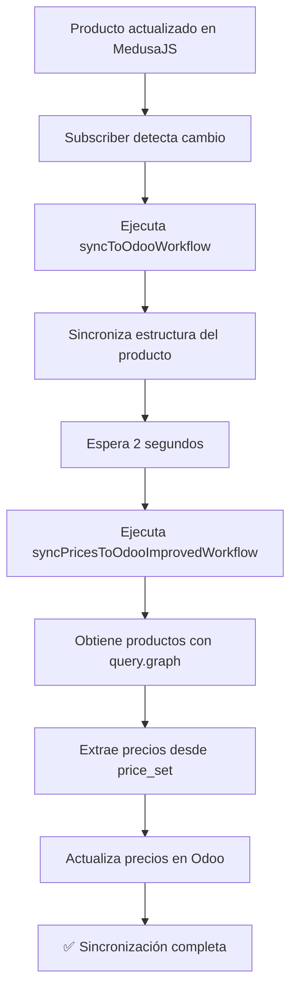

# 🚀 Mejoras en Sincronización de Precios a Odoo

## 📋 Resumen de Cambios

Se ha mejorado significativamente el sistema de sincronización de precios desde MedusaJS hacia Odoo, utilizando el mismo método exitoso del endpoint `/admin/list-all-products-prices` que ya estaba funcionando correctamente.

## ✨ Principales Mejoras

### 1. **Nuevo Workflow de Sincronización Mejorado**
   - **Archivo**: `backend/src/workflows/sync-prices-to-odoo-improved.ts`
   - **Cambio clave**: Usa `query.graph` con `price_set.prices.*` para obtener precios directamente
   - **Ventajas**:
     - Método más directo y confiable para obtener precios
     - Mismo enfoque exitoso del endpoint de listado de productos
     - Menor complejidad en el filtrado de precios
     - Mejor rendimiento al obtener datos relacionados

### 2. **Actualización del Workflow Principal**
   - **Archivo**: `backend/src/workflows/sync-to-odoo.ts`
   - **Cambios**:
     - Reemplazó `productModuleService.listProducts()` por `query.graph`
     - Nueva función `getProductPriceFromPriceSet()` en lugar de `getProductPrice()`
     - Obtiene precios directamente desde `variant.price_set.prices`
     - Eliminó código complejo de filtrado manual de precios

### 3. **Subscriber Actualizado**
   - **Archivo**: `backend/src/subscribers/product-updated.ts`
   - **Cambio**: Ahora usa `syncPricesToOdooImprovedWorkflow` en lugar de `syncPricesToOdooWorkflow`
   - **Resultado**: Sincronización automática más confiable cuando se actualizan productos

### 4. **Job Programado Mejorado**
   - **Archivo**: `backend/src/jobs/sync-prices-to-odoo-scheduled.ts`
   - **Cambio**: Ejecuta el workflow mejorado cada 5 minutos
   - **Resultado**: Precios sincronizados automáticamente de forma frecuente y confiable

### 5. **Nuevo Endpoint de Sincronización Manual**
   - **URL**: `GET /admin/sync-prices-now`
   - **Parámetros**:
     - `productIds`: IDs de productos separados por coma (opcional)
     - `limit`: Límite de productos (default: 10)
     - `offset`: Offset para paginación (default: 0)
     - `regionId`: ID de región para precios (opcional, auto-detecta CLP)
   - **Ejemplo**:
     ```bash
     GET /admin/sync-prices-now?productIds=prod_01K6FVD1BY2CG2PT0JCVM4D8P1&limit=5
     ```

## 🔍 Método de Obtención de Precios

### ❌ Método Anterior (Problemático)
```typescript
// Obtenía TODOS los precios del sistema y filtraba manualmente
const allPrices = await pricingModuleService.listPrices()
const variantPrices = allPrices.filter(price => {
  return price.variant_id === variantId || 
         price.price_set_id === variantId ||
         // ... múltiples condiciones complejas
})
```

**Problemas:**
- Ineficiente: carga todos los precios del sistema
- Complejo: requiere múltiples condiciones de filtrado
- Propenso a errores: diferentes estructuras de datos

### ✅ Método Mejorado (Actual)
```typescript
// Obtiene productos CON sus precios directamente
const productsResult = await query.graph({
  entity: "product",
  fields: [
    "variants.price_set.id",
    "variants.price_set.prices.*"
  ]
})

// Precio ya disponible en la estructura
const price = variant.price_set.prices.find(
  p => p.currency_code === currencyCode
)?.amount
```

**Ventajas:**
- ✅ Eficiente: obtiene solo los datos necesarios
- ✅ Simple: estructura de datos directa
- ✅ Confiable: mismo método del endpoint exitoso
- ✅ Mejor rendimiento: menos queries a la BD

## 📊 Flujo de Sincronización



## 🧪 Cómo Probar

### 1. **Verificar Precios en MedusaJS**
```bash
GET https://backend-production-6f9f.up.railway.app/admin/list-all-products-prices
```

Deberías ver algo como:
```json
{
  "success": true,
  "productsOK": [
    {
      "title": "Pantalones cortos",
      "variants": [
        {
          "sku": "SHORTS-S",
          "prices": [
            {"currency": "CLP", "amount": 10000}
          ]
        }
      ]
    }
  ]
}
```

### 2. **Probar Sincronización de Precios**
```bash
GET https://backend-production-6f9f.up.railway.app/admin/sync-prices-now?limit=5
```

Respuesta esperada:
```json
{
  "success": true,
  "message": "Sincronización de precios completada",
  "results": {
    "syncedProducts": 5,
    "syncedVariants": 20,
    "syncedPrices": 20,
    "errorCount": 0,
    "errors": []
  }
}
```

### 3. **Sincronizar un Producto Específico**
```bash
GET https://backend-production-6f9f.up.railway.app/admin/sync-prices-now?productIds=prod_01K6FVD1BY2CG2PT0JCVM4D8P1
```

### 4. **Verificar en Odoo**
- Inicia sesión en tu instancia de Odoo
- Ve a: **Inventario > Productos**
- Busca el producto sincronizado por su `default_code` (handle de Medusa)
- Verifica que el campo `list_price` tenga el precio correcto

## 📝 Estructura de Precios en Odoo

La sincronización actualiza los siguientes campos en Odoo:

### Product Template (`product.template`)
- **`list_price`**: Precio base del producto (precio más bajo de todas las variantes)

### Product Variant (`product.product`)
- **`list_price`**: Precio específico de la variante
- **`price_extra`**: Diferencia con el precio base (calculado automáticamente)

**Ejemplo:**
```
Producto: "Pantalones cortos"
├── Precio base (template): $10,000 CLP
├── Variante S: 
│   ├── list_price: $10,000
│   └── price_extra: $0
├── Variante M: 
│   ├── list_price: $10,000
│   └── price_extra: $0
└── Variante L: 
    ├── list_price: $10,500
    └── price_extra: $500
```

## 🔄 Sincronización Automática

Los precios se sincronizan automáticamente en los siguientes casos:

1. **Al actualizar un producto en MedusaJS** (via subscriber)
2. **Cada 5 minutos** (via scheduled job)
3. **Manualmente** (via endpoint `/admin/sync-prices-now`)

## 🐛 Troubleshooting

### Problema: Precios no se sincronizan
**Solución:**
1. Verifica que el producto exista en Odoo (debe tener `x_medusa_id`)
2. Verifica que las variantes tengan SKU definido
3. Revisa los logs del backend para errores específicos
4. Usa el endpoint de sincronización manual para debugging: `/admin/sync-prices-now?productIds=PRODUCT_ID`

### Problema: Precios en 0
**Solución:**
1. Verifica que la región CLP esté configurada en MedusaJS
2. Verifica que los productos tengan precios asignados en CLP
3. Usa el endpoint `/admin/list-all-products-prices` para verificar precios

### Problema: Variantes no se encuentran en Odoo
**Solución:**
1. Asegúrate de que el producto se haya sincronizado primero (estructura y variantes)
2. Verifica que las variantes en Odoo tengan el campo `default_code` (SKU) correcto
3. Espera unos segundos después de sincronizar la estructura antes de sincronizar precios

## 📚 Archivos Modificados

- ✅ `backend/src/workflows/sync-to-odoo.ts` - Workflow principal mejorado
- ✅ `backend/src/workflows/sync-prices-to-odoo-improved.ts` - Nuevo workflow de precios
- ✅ `backend/src/subscribers/product-updated.ts` - Subscriber actualizado
- ✅ `backend/src/jobs/sync-prices-to-odoo-scheduled.ts` - Job programado actualizado
- ✅ `backend/src/api/admin/sync-prices-now/route.ts` - Endpoint de sincronización manual

## 🎯 Próximos Pasos

1. **Probar la sincronización** usando el endpoint `/admin/sync-prices-now`
2. **Verificar en Odoo** que los precios se actualizaron correctamente
3. **Actualizar un producto** en MedusaJS y verificar sincronización automática
4. **Monitorear los logs** para detectar posibles errores

## ⚡ Ventajas de la Nueva Implementación

1. **Más Confiable**: Usa el mismo método del endpoint exitoso
2. **Más Eficiente**: Menos queries a la base de datos
3. **Más Simple**: Código más limpio y fácil de mantener
4. **Mejor Debugging**: Endpoint de prueba dedicado
5. **Auto-documentado**: Logs detallados en cada paso

---

**Fecha de implementación**: Octubre 8, 2025  
**Versión**: 2.0 - Mejorada con query.graph

