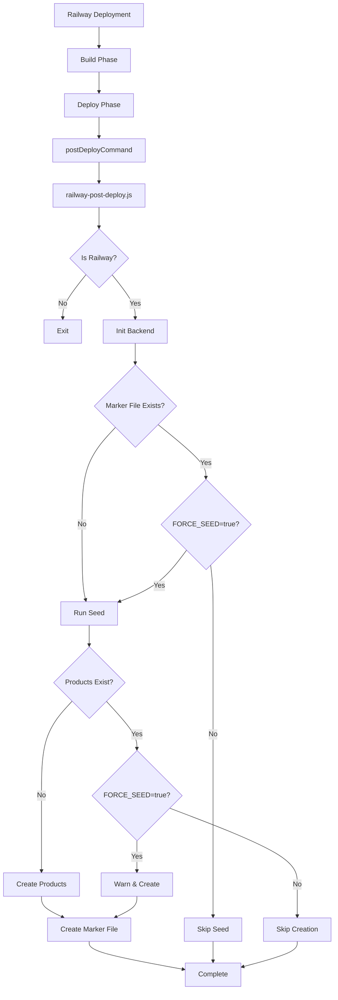

# 🚀 Guía de Seed en Railway

## 📝 Descripción del Problema

Cuando despliegas tu aplicación MedusaJS en Railway, los productos definidos en `seed.ts` no se crean automáticamente. Esta guía explica por qué sucede esto y cómo solucionarlo.

## 🔍 Problemas Identificados

### 1. **Railway.json no ejecutaba el script correcto**
- **Antes**: `"postDeployCommand": "npm run ib"` 
- **Ahora**: `"postDeployCommand": "node railway-post-deploy.js"`

### 2. **El seed.ts tenía una verificación prematura**
- El seed verificaba si existían productos y salía inmediatamente
- Ahora respeta la variable de entorno `FORCE_SEED=true`

### 3. **Faltaba inicialización del backend**
- El script ahora ejecuta `init-backend` antes del seed

## ✅ Soluciones Implementadas

### Cambios Realizados:

1. **railway.json** - Ahora ejecuta `railway-post-deploy.js` correctamente
2. **railway-post-deploy.js** - Mejorado con:
   - Inicialización automática del backend
   - Soporte para `FORCE_SEED` variable de entorno
   - Mejor logging y manejo de errores
3. **seed.ts** - Actualizado para respetar `FORCE_SEED`

## 🎯 Cómo Usar

### Para el Primer Deployment:

1. **Asegúrate de que tu base de datos esté vacía o lista para recibir datos**

2. **Haz push a Railway:**
   ```bash
   git add .
   git commit -m "Fix seed execution in Railway"
   git push
   ```

3. **El seed se ejecutará automáticamente después del deployment**

### Para Re-ejecutar el Seed:

Si necesitas volver a ejecutar el seed (por ejemplo, después de limpiar la BD):

#### Opción 1: Variable de Entorno en Railway

1. Ve a tu proyecto en Railway
2. Navega a: **Variables** → **Add Variable**
3. Agrega: `FORCE_SEED` = `true`
4. **Re-deploy** el proyecto
5. **IMPORTANTE**: Después de que se ejecute, **elimina la variable** `FORCE_SEED` para evitar duplicados en futuros deployments

#### Opción 2: API Endpoint Manual

Después de que tu aplicación esté corriendo, puedes ejecutar el seed manualmente:

```bash
# Usando curl (reemplaza YOUR_ADMIN_URL con tu URL de Railway)
curl -X POST https://YOUR_ADMIN_URL/admin/seed \
  -H "Content-Type: application/json"
```

O desde el navegador:
```
https://YOUR_ADMIN_URL/admin/seed
```

#### Opción 3: Desde la Terminal de Railway

1. Ve a tu servicio en Railway
2. Abre la terminal
3. Ejecuta:
   ```bash
   npx medusa exec ./src/scripts/seed.ts
   ```

## 📊 Verificación

### Logs a Buscar en Railway:

Durante el deployment, deberías ver estos logs:

```
🚀 Railway Post-Deploy Script Starting...
🔍 Environment variables:
  - NODE_ENV: production
  - RAILWAY_ENVIRONMENT: production
  - RAILWAY_PROJECT_ID: [tu-project-id]
🌍 Is Railway? true
🌍 Railway environment detected, proceeding...
🔧 Initializing backend...
✅ Backend initialized successfully!
🌱 Running database seed...
📁 Current directory: /app
📂 Seed file path: ./src/scripts/seed.ts
Seeding Chilean pet store data...
Seeding Chilean region data...
...
✅ Successfully created 50 products for Chile
🎉 Chilean pet store setup completed!
✅ Post-deploy seed completed successfully!
🎉 Post-deploy tasks completed!
```

### Si el Seed Ya Se Ejecutó:

```
✅ Seed already completed, skipping...
ℹ️ To force seed, set FORCE_SEED=true environment variable
```

## 🛠️ Scripts Disponibles

### Localmente:

```bash
# Ejecutar seed normal
npm run seed

# Forzar ejecución del seed (ignora productos existentes)
FORCE_SEED=true npm run seed

# Iniciar con seed
npm run start:with-seed
```

## ⚠️ Advertencias Importantes

### 1. **No Ejecutes el Seed Múltiples Veces**
- Cada ejecución creará productos duplicados
- Usa `FORCE_SEED=true` solo cuando sea necesario
- Elimina la variable de entorno después de usarla

### 2. **Base de Datos con Datos Existentes**
- Si tu BD ya tiene productos, el seed **no se ejecutará** (por defecto)
- Esto es intencional para prevenir duplicados
- Si necesitas re-seed, primero limpia la BD o usa `FORCE_SEED=true`

### 3. **Marker File (.seed-completed)**
- Railway crea un archivo `.seed-completed` después del primer seed exitoso
- Este archivo previene ejecuciones duplicadas
- El archivo persiste entre deployments en el mismo volumen
- Puedes sobrescribirlo con `FORCE_SEED=true`

## 🔄 Flujo de Ejecución



## 📚 Recursos Adicionales

- [MedusaJS Documentation](https://docs.medusajs.com)
- [Railway Documentation](https://docs.railway.app)
- [Railway Environment Variables](https://docs.railway.app/develop/variables)

## 🆘 Troubleshooting

### Problema: El seed no se ejecuta en Railway

**Soluciones:**
1. Verifica los logs de deployment en Railway
2. Asegúrate de que `railway.json` tenga `"postDeployCommand": "node railway-post-deploy.js"`
3. Verifica que las variables de entorno de la BD estén configuradas
4. Intenta ejecutar manualmente vía API: `POST /admin/seed`

### Problema: "Seed already completed, skipping..."

**Soluciones:**
1. Si realmente necesitas re-ejecutar: agrega `FORCE_SEED=true` en Railway
2. O ejecuta manualmente: `POST /admin/seed`
3. O limpia la BD y re-deploy

### Problema: Productos duplicados

**Soluciones:**
1. Elimina los productos duplicados desde el Admin
2. O limpia la base de datos completamente
3. Asegúrate de **remover** `FORCE_SEED=true` después de usarlo

### Problema: "Error during post-deploy tasks"

**Soluciones:**
1. Revisa los logs completos en Railway
2. Verifica la conexión a la base de datos
3. Asegúrate de que todas las dependencias estén instaladas
4. Verifica que el archivo `seed.ts` no tenga errores de sintaxis

## 📞 Soporte

Si sigues teniendo problemas:
1. Revisa los logs completos en Railway Dashboard
2. Verifica que todas las variables de entorno estén configuradas
3. Prueba ejecutar el seed manualmente vía API
4. Contacta al equipo de soporte con los logs específicos


