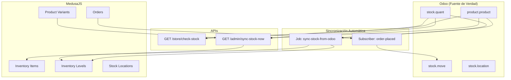
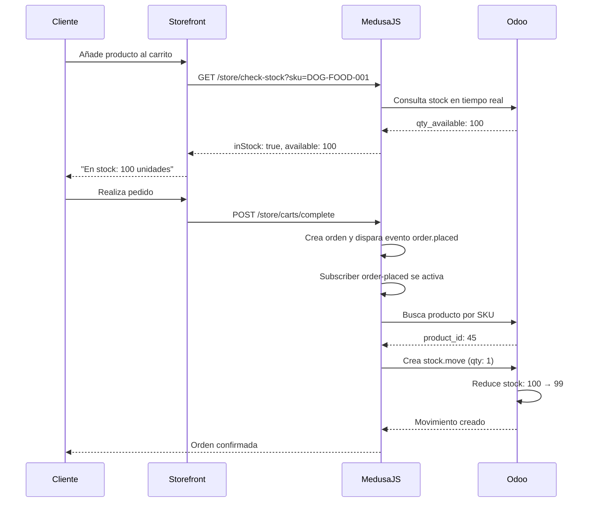
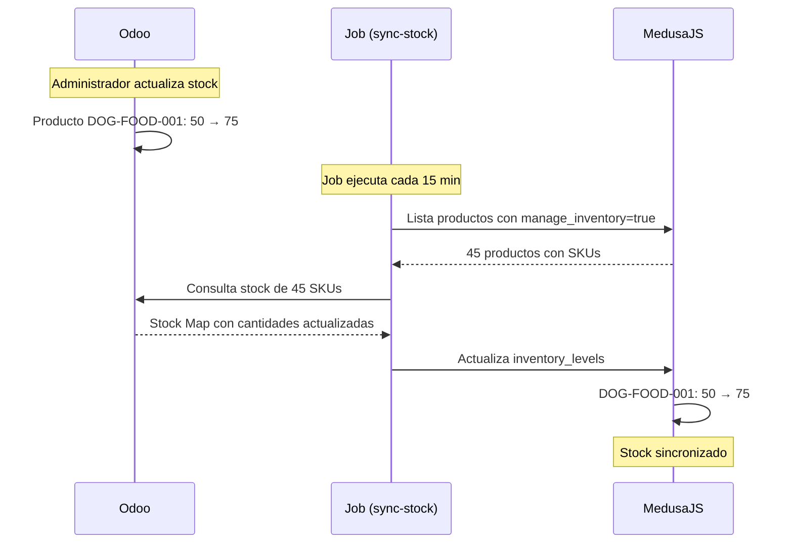

# 📦 Guía de Sincronización de Stock MedusaJS ↔ Odoo

## 🎯 Resumen

Este sistema implementa **sincronización bidireccional de inventario** entre MedusaJS y Odoo, además de **verificación de stock en tiempo real**. El stock en Odoo es la fuente de verdad, y MedusaJS se mantiene actualizado automáticamente.

---

## ✨ Características Implementadas

### 1. 🔄 Sincronización Odoo → MedusaJS (Automática)
- **Job programado** que se ejecuta cada 15 minutos
- Actualiza niveles de inventario en MedusaJS basándose en Odoo
- Sincroniza solo productos que tienen `manage_inventory = true`

### 2. 📤 Sincronización MedusaJS → Odoo (Automática)
- **Subscriber** que se activa al colocar una orden
- Crea movimientos de stock en Odoo automáticamente
- Registra las ventas y reduce el stock en Odoo

### 3. 🔍 Verificación de Stock en Tiempo Real
- **Endpoint público** para consultar disponibilidad antes de añadir al carrito
- Consulta directamente a Odoo para obtener stock actualizado
- Soporte para verificación individual o múltiple

### 4. ⚡ Sincronización Manual (Admin)
- **Endpoint admin** para sincronizar stock manualmente
- Útil para pruebas y sincronizaciones inmediatas
- Permite filtrar por SKUs específicos

---

## 🏗️ Arquitectura del Sistema



---

## 📋 Componentes Implementados

### 1. **OdooClient Service** (`backend/src/services/odoo-client.ts`)

Métodos nuevos para gestión de stock:

#### `getProductStock(productId: number)`
Obtiene información de stock de un producto específico en Odoo.

```typescript
const stock = await odooClient.getProductStock(123)
// Retorna:
{
  qty_available: 50,      // Stock disponible
  virtual_available: 48,  // Stock virtual (incluye reservas)
  incoming_qty: 0,        // Cantidad entrante
  outgoing_qty: 2         // Cantidad saliente
}
```

#### `getProductsStockBySku(skus: string[])`
Obtiene stock de múltiples productos por SKU.

```typescript
const stockMap = await odooClient.getProductsStockBySku(['SKU123', 'SKU456'])
// Retorna Map<string, { qty_available, virtual_available, product_id }>
```

#### `createStockMove(productId, quantity, reference)`
Crea un movimiento de stock en Odoo (para registrar ventas).

```typescript
await odooClient.createStockMove(123, 5, 'Medusa Order #1234')
// Registra venta de 5 unidades del producto 123
```

---

### 2. **Job Programado** (`backend/src/jobs/sync-stock-from-odoo.ts`)

**Frecuencia:** Cada 15 minutos

**Proceso:**
1. Obtiene todas las variantes de MedusaJS con `manage_inventory = true`
2. Extrae los SKUs de las variantes
3. Consulta stock en Odoo para esos SKUs
4. Actualiza los `inventory_levels` en MedusaJS

**Configuración:**
```typescript
export const config = {
  name: "sync-stock-from-odoo",
  schedule: "*/15 * * * *", // Cada 15 minutos
}
```

**Logs de ejemplo:**
```
🔄 Iniciando sincronización de stock desde Odoo...
📦 Encontrados 45 productos con gestión de inventario
🔍 Consultando stock en Odoo para 45 SKUs...
📊 Stock obtenido para 42 productos desde Odoo
✅ Stock actualizado para SKU DOG-FOOD-001: 100 → 95
📊 Sincronización de stock completada:
   ✅ Niveles actualizados: 42
   ❌ Errores: 0
```

---

### 3. **Subscriber de Órdenes** (`backend/src/subscribers/order-placed.ts`)

**Evento:** `order.placed`

**Proceso:**
1. Se coloca una orden en MedusaJS
2. Envía notificación por email (existente)
3. **NUEVO:** Para cada item de la orden:
   - Obtiene el SKU de la variante
   - Busca el producto en Odoo por SKU
   - Crea un movimiento de stock (`stock.move`) en Odoo
   - Reduce automáticamente el stock en Odoo

**Logs de ejemplo:**
```
📦 Sincronizando stock con Odoo para orden #1234...
🔍 Procesando item: Alimento para Perros (SKU: DOG-FOOD-001, Qty: 2)
📦 Producto encontrado en Odoo: ID 45, Stock actual: 100
✅ Movimiento de stock creado en Odoo: 567 para 2 unidades
✅ Stock actualizado en Odoo para SKU DOG-FOOD-001: -2 unidades
✅ Sincronización de stock con Odoo completada para orden #1234
```

---

### 4. **Endpoint de Verificación (Store API)** (`backend/src/api/store/check-stock/route.ts`)

#### GET `/store/check-stock`
Verifica disponibilidad de un producto.

**Parámetros:**
- `sku` (requerido): SKU del producto
- `quantity` (opcional, default: 1): Cantidad deseada

**Ejemplo de uso:**
```bash
GET /store/check-stock?sku=DOG-FOOD-001&quantity=5
```

**Respuesta:**
```json
{
  "success": true,
  "inStock": true,
  "available": 100,
  "virtual_available": 98,
  "requested": 5,
  "sku": "DOG-FOOD-001",
  "product_id": 45
}
```

#### POST `/store/check-stock`
Verifica disponibilidad de múltiples productos.

**Body:**
```json
{
  "items": [
    { "sku": "DOG-FOOD-001", "quantity": 2 },
    { "sku": "CAT-TOY-002", "quantity": 1 }
  ]
}
```

**Respuesta:**
```json
{
  "success": true,
  "allInStock": true,
  "items": [
    {
      "sku": "DOG-FOOD-001",
      "requested": 2,
      "inStock": true,
      "available": 100,
      "virtual_available": 98,
      "product_id": 45
    },
    {
      "sku": "CAT-TOY-002",
      "requested": 1,
      "inStock": true,
      "available": 50,
      "virtual_available": 50,
      "product_id": 67
    }
  ],
  "summary": {
    "total": 2,
    "available": 2,
    "unavailable": 0
  }
}
```

---

### 5. **Endpoint Admin de Sincronización** (`backend/src/api/admin/sync-stock-now/route.ts`)

#### GET `/admin/sync-stock-now`
Sincroniza stock manualmente desde el admin.

**Parámetros:**
- `limit` (opcional, default: 50): Máximo de productos a sincronizar
- `offset` (opcional, default: 0): Offset para paginación
- `skus` (opcional): SKUs específicos separados por coma

**Ejemplos:**

```bash
# Sincronizar todos los productos (máximo 50)
GET /admin/sync-stock-now

# Sincronizar 100 productos
GET /admin/sync-stock-now?limit=100

# Sincronizar SKUs específicos
GET /admin/sync-stock-now?skus=DOG-FOOD-001,CAT-TOY-002,BIRD-CAGE-003
```

**Respuesta:**
```json
{
  "success": true,
  "message": "Sincronización completada exitosamente",
  "summary": {
    "totalProducts": 45,
    "totalSkus": 45,
    "foundInOdoo": 42,
    "updated": 38,
    "errors": 0
  },
  "updates": [
    {
      "sku": "DOG-FOOD-001",
      "product": "Alimento para Perros",
      "oldQuantity": 100,
      "newQuantity": 95
    }
  ],
  "errors": []
}
```

---

## 🔧 Configuración

### Variables de Entorno Requeridas

Las siguientes variables deben estar configuradas en tu archivo `.env`:

```bash
# Odoo Configuration
ODOO_URL=https://your-odoo-instance.com
ODOO_DATABASE=your_database
ODOO_USERNAME=your_username
ODOO_PASSWORD=your_password
```

### Configuración de Stock Location

Por defecto, el sistema busca una ubicación de stock llamada **"Chilean Pet Warehouse"**. Si no existe, usa la primera disponible.

Para verificar/crear ubicaciones de stock en MedusaJS, ejecuta:

```bash
npx medusa exec ./src/scripts/seed.ts
```

---

## 🧪 Pruebas y Uso

### 1. **Probar Sincronización Manual (Admin)**

```bash
# Usando curl
curl -X GET "http://localhost:9000/admin/sync-stock-now?limit=10" \
  -H "Authorization: Bearer YOUR_ADMIN_TOKEN"

# Usando el navegador (si estás autenticado)
http://localhost:9000/admin/sync-stock-now
```

### 2. **Probar Verificación de Stock (Store)**

```bash
# Verificar un producto
curl "http://localhost:9000/store/check-stock?sku=DOG-FOOD-001&quantity=5"

# Verificar múltiples productos
curl -X POST "http://localhost:9000/store/check-stock" \
  -H "Content-Type: application/json" \
  -d '{
    "items": [
      {"sku": "DOG-FOOD-001", "quantity": 2},
      {"sku": "CAT-TOY-002", "quantity": 1}
    ]
  }'
```

### 3. **Verificar Job Programado**

El job se ejecuta automáticamente cada 15 minutos. Para ejecutarlo manualmente:

```bash
# No hay comando directo, pero puedes reiniciar el servidor
# El job se ejecutará en el siguiente intervalo programado
```

### 4. **Probar Subscriber de Órdenes**

1. Crea una orden en el storefront o vía API
2. Revisa los logs del backend
3. Verifica en Odoo que se creó el movimiento de stock:
   - Ve a **Inventario > Operaciones > Movimientos de Stock**
   - Busca por referencia: "Medusa Order #XXXX"

---

## 📊 Flujo Completo de Sincronización

### Escenario 1: Cliente Compra un Producto



### Escenario 2: Stock Actualizado en Odoo



---

## 🐛 Troubleshooting

### Problema: Stock no se sincroniza

**Causas posibles:**
1. Variables de entorno de Odoo no configuradas
2. Productos no tienen SKU definido
3. Productos no tienen `manage_inventory = true`

**Solución:**
```bash
# 1. Verifica variables de entorno
echo $ODOO_URL
echo $ODOO_DATABASE

# 2. Verifica SKUs en MedusaJS
npx medusa exec ./src/scripts/check-all-prices.ts

# 3. Sincroniza manualmente
curl "http://localhost:9000/admin/sync-stock-now?limit=5"
```

### Problema: Movimientos de stock no aparecen en Odoo

**Causas posibles:**
1. Producto no existe en Odoo
2. SKU no coincide entre MedusaJS y Odoo
3. Ubicaciones de stock no configuradas en Odoo

**Solución:**
```bash
# Verifica que el producto existe en Odoo
# Ve a Odoo > Inventario > Productos
# Busca por el SKU del producto

# Verifica los logs del backend
# Deberías ver: "Producto encontrado en Odoo: ID XXX"
```

### Problema: Endpoint de verificación retorna "Producto no encontrado"

**Causa:** SKU no existe en Odoo o no coincide

**Solución:**
1. Verifica que el producto esté sincronizado en Odoo
2. Asegúrate de que el campo `default_code` en Odoo coincida con el SKU de MedusaJS
3. Ejecuta sincronización de productos primero:
   ```bash
   curl "http://localhost:9000/admin/sync-products-now"
   ```

---

## 📈 Monitoreo y Logs

### Logs del Job de Sincronización

```bash
# Buscar logs del job
grep "sync-stock-from-odoo" logs/medusa.log

# Ver solo actualizaciones exitosas
grep "Stock actualizado para SKU" logs/medusa.log
```

### Logs del Subscriber

```bash
# Buscar logs de sincronización de órdenes
grep "Sincronizando stock con Odoo para orden" logs/medusa.log

# Ver movimientos de stock creados
grep "Movimiento de stock creado" logs/medusa.log
```

---

## 🔄 Frecuencias de Sincronización

| Tipo | Frecuencia | Configurable |
|------|-----------|--------------|
| Odoo → MedusaJS | Cada 15 minutos | ✅ Sí (en config del job) |
| MedusaJS → Odoo | Inmediato (al colocar orden) | ❌ No (evento) |
| Verificación en tiempo real | Bajo demanda | N/A |
| Sincronización manual | Bajo demanda | N/A |

Para cambiar la frecuencia del job:

```typescript
// backend/src/jobs/sync-stock-from-odoo.ts
export const config = {
  name: "sync-stock-from-odoo",
  schedule: "*/15 * * * *", // Modifica aquí (formato cron)
}

// Ejemplos:
// "*/5 * * * *"  - Cada 5 minutos
// "*/30 * * * *" - Cada 30 minutos
// "0 * * * *"    - Cada hora
```

---

## 🎯 Mejores Prácticas

### 1. **Configurar Gestión de Inventario**

Al crear productos en MedusaJS, asegúrate de activar `manage_inventory`:

```typescript
{
  title: "Producto",
  variants: [{
    title: "Default",
    sku: "PRODUCT-001",
    manage_inventory: true,  // ✅ Importante
    allow_backorder: false   // No permitir pedidos sin stock
  }]
}
```

### 2. **Usar SKUs Consistentes**

- SKUs deben ser únicos
- Deben coincidir exactamente entre MedusaJS y Odoo
- Recomendación: Usar formato `CATEGORY-NAME-ID` (ej: `DOG-FOOD-001`)

### 3. **Verificar Stock Antes de Añadir al Carrito**

En el storefront, verifica stock antes de permitir añadir al carrito:

```typescript
// En tu componente de producto
const checkStock = async (sku: string, quantity: number) => {
  const response = await fetch(
    `/store/check-stock?sku=${sku}&quantity=${quantity}`
  )
  const data = await response.json()
  return data.inStock
}
```

### 4. **Monitorear Logs Regularmente**

Configura alertas para errores de sincronización:

```bash
# Contar errores en las últimas 24 horas
grep "Error sincronizando stock" logs/medusa.log | tail -100
```

---

## 📚 Archivos Creados/Modificados

### Archivos Nuevos:
- ✅ `backend/src/jobs/sync-stock-from-odoo.ts` - Job de sincronización Odoo → Medusa
- ✅ `backend/src/api/store/check-stock/route.ts` - Endpoint de verificación de stock
- ✅ `backend/src/api/admin/sync-stock-now/route.ts` - Endpoint admin de sincronización
- ✅ `backend/STOCK-SYNC-GUIDE.md` - Esta documentación

### Archivos Modificados:
- ✅ `backend/src/services/odoo-client.ts` - Métodos de stock añadidos
- ✅ `backend/src/subscribers/order-placed.ts` - Lógica de sincronización de stock añadida

---

## 🚀 Próximos Pasos Recomendados

1. **Implementar en el Storefront:**
   - Añadir indicador de stock en páginas de producto
   - Deshabilitar botón "Añadir al carrito" si no hay stock
   - Mostrar cantidad disponible

2. **Optimizaciones:**
   - Implementar caché para consultas de stock frecuentes
   - Agregar retry logic para sincronizaciones fallidas
   - Implementar cola de trabajos para órdenes con alto volumen

3. **Alertas:**
   - Configurar alertas cuando stock esté bajo (< 10 unidades)
   - Notificar cuando sincronización falle repetidamente
   - Dashboard de monitoreo de inventario

---

**Fecha de implementación:** Octubre 9, 2025  
**Versión:** 1.0 - Sincronización Bidireccional Completa

